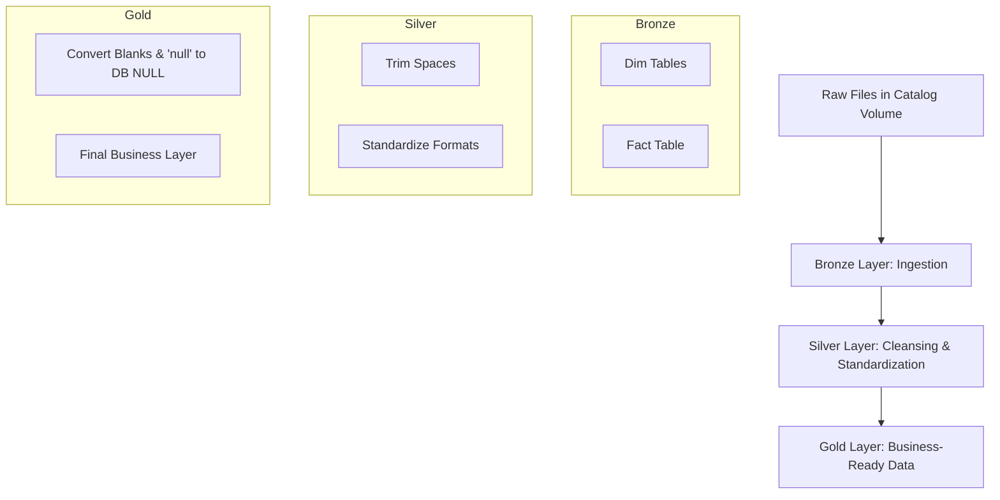

# Databricks ETL Project – Dimensional & Fact Data Pipeline

## 📌 Project Overview
This project implements a **layered ETL pipeline** in Databricks using a **medallion architecture** (Bronze → Silver → Gold).  
The goal is to design a **scalable, production-ready data pipeline** that ingests, cleans, and transforms **dimension and fact data** for downstream analytics and reporting.  

- **Data Sources**:  
  - 5 Dimension files (customer, product, location, etc.)  
  - 1 Fact file (transactions)  
  - All files are stored in **Databricks Catalog Volumes**  

- **Pipeline Flow**:  
  1. **Bronze Layer** – Raw ingestion (data loaded *as-is* from source).  
  2. **Silver Layer** – Standardized data with cleansing (e.g., removal of leading/trailing spaces).  
  3. **Gold Layer** – Curated data, business-ready (e.g., blanks and string `"null"` converted to true database `NULL`).  

This structured approach ensures **data lineage, quality, and readiness** for analytics and machine learning use cases.  

---

## 🏗️ High-Level Architecture



---

## ⚙️ Jobs & Notebooks

### **1. `customer_trans_onetime_ddl`**
- **Purpose**: One-time creation of tables across Bronze, Silver, and Gold layers.  
- **Notebooks**:  
  - `bronze_dim_fact_onetime_ddl`  
  - `silver_dim_fact_onetime_ddl`  
  - `gold_dim_fact_onetime_ddl`  
- **Key Outcome**: Ensures all layers have consistent schema for dimension and fact tables.  

---

### **2. `customer_trans_dim_load`**
- **Purpose**: Load all **dimension tables** across the layers.  
- **Notebooks**:  
  - `customer_dim_bronze_load`  
  - `customer_dim_silver_load`  
  - `customer_dim_gold_load`  
- **Key Outcome**: Dimension data is progressively refined and made analytics-ready.  

---

### **3. `customer_trans_fact_day0_load`**
- **Purpose**: Load the **fact table** across the layers for initial Day-0 load.  
- **Notebook**:  
  - `fact_day0_load`  
- **Key Outcome**: Provides the baseline transaction data for analytics, ensuring full load integrity.  

---

## 📂 Repository Structure

```
databricks-etl-project/
│
├── src/                 # All notebooks
│   ├── bronze_dim_fact_onetime_ddl.py
│   ├── silver_dim_fact_onetime_ddl.py
│   ├── gold_dim_fact_onetime_ddl.py
│   ├── customer_dim_bronze_load.py
│   ├── customer_dim_silver_load.py
│   ├── customer_dim_gold_load.py
│   └── fact_day0_load.py
│
├── jobs/                # Job configurations (YAML files)
│   ├── customer_trans_onetime_ddl.yml
│   ├── customer_trans_dim_load.yml
│   └── customer_trans_fact_day0_load.yml
│
└── README.md            # Project documentation
```

---

## 🚀 Next Steps
1. **Implement Great Expectations (GX)** for **data quality validation** (e.g., null checks, reference integrity, business rules).  
2. Add **incremental load** logic for the Fact table (CDC support).  
3. Configure **GitHub Actions CI/CD** to automatically deploy Databricks workflows using the YAML job definitions.  
4. Introduce **data lineage tracking** and **observability dashboards**.  
5. Explore **Delta Live Tables (DLT)** for pipeline automation.  

---

## ✅ Key Highlights
- **End-to-End Pipeline**: Ingestion → Standardization → Business-Ready.  
- **Medallion Architecture** ensures **scalability, modularity, and governance**.  
- **Automation via Jobs**: DDL, Dimension Load, Fact Load.  
- **GitOps Friendly**: Jobs and notebooks are version-controlled in GitHub.  
- **Future-Proofing**: Plan to add GX validations, CI/CD pipelines, and incremental processing.  

---

## 🌟 Achievements
- Designed a **robust ETL workflow** handling both dimension and fact tables.  
- Built **separation of concerns** between schema setup, dimension load, and fact load.  
- Ensured **data quality improvements** at each stage (raw → clean → curated).  
- Laid foundation for **enterprise-grade data engineering practices** with validations and CI/CD.  